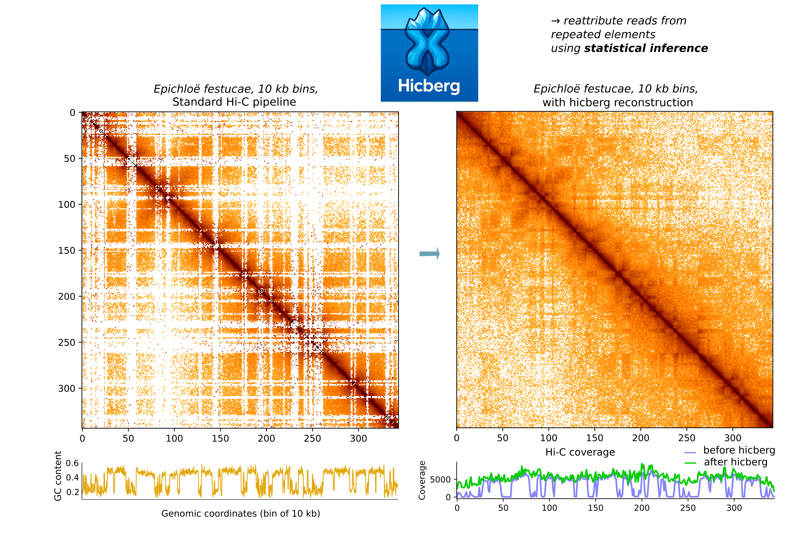

# Hicberg



[](https://choosealicense.com/licenses/mit/)
[](https://opensource.org/licenses/)
[](http://www.gnu.org/licenses/agpl-3.0)
[](https://codecov.io/gh/sebgra/hicberg)

Python package to reconstruct genomic signals from paired end data like Hi-C coming from repeated elements

### Installation  

Create environment by using following command :

```bash
mamba env create -n [ENV_NAME] -f hicberg.yaml;
```

To ensure that hicberg is correctly working, Bowtie2, Samtools, bedGraphToBigWig and BedTools have to be installed. These can be install through : 

```bash
mamba install bowtie2 -c bioconda;
mamba install samtools -c bioconda;
mamba install -c bioconda ucsc-bedgraphtobigwig;
mamba install bedtools -c bioconda;
```

Depending on your aligner preferences, `BWA` and `Minimap2` might be installed through:

```bash
mamba install bioconda::bwa;
mamba install bioconda::minimap2
```

#### Conda / Mamba

We highly recommend installing Hicberg through [Mamba](https://mamba.readthedocs.io/en/latest/mamba-installation.html#mamba-install).

```bash
mamba install -c bioconda hicberg
```

```bash

wget "https://github.com/conda-forge/miniforge/releases/latest/download/Mambaforge-$(uname)-$(uname -m).sh"
bash Mambaforge-$(uname)-$(uname -m).sh
mamba create -n hicberg python=3.11.4
mamba activate hicberg
mamba install bioconda::bowtie2
mamba install bioconda::samtools
mamba install bioconda::bedtools
mamba install bioconda::ucsc-bedgraphtobigwig

# For exhaustive aligners usage
mamba install bioconda::bwa;
mamba install bioconda::minimap2
```

### Usage

`hicberg` requires a FASTA file containing the reference genome against which the reads will be aligned, as well as two paired-end FASTQ files generated from a Hi-C, MicroC, ChIP-seq, or Mnase experiment. You can always run:

```bash
hicberg --help
```
Differents modes can be used to compute the probabilities of alignments for the different possibilities of reads coming from repeated elements.

### Example

```bash
hicberg pipeline -e DpnII,HinfI --cpus 8 -o /home/bob/ -n output_repo/ yeast_reference_genome.fa  reads_R1.fastq reads_R2.fastq 
```

### Important options 

When running `hicberg`, there are a handful parameters which are especially important:

* `-e DpnII,HinfI`: Restriction enzymes used in the Hi-C protocole (e.g DpnII, HinfI).
* `-k 100`: maximum number of alignments returned by Bowtie2 for a read (for organisms with repetitive elements with a  large number of occurrences, we recommend limiting the search space).
* `-m standard`: mode for the computation of probabilites, (standard uses coverage and p(s), full uses coverage, p(s) and density laws). 
* `--cpus 10`: number of cpu to allocate.
* `-c plasmid2micron,chrMT`: circular chromosomes, molecule present in the genome (used in the computation of p(s) behavior).
* `-o`: directory in which the output directory will be placed.
* `-n`: name of the output folder that will contain the reconstructed data for a given experiment.   

### <a id="contributing"></a> Contributing

All contributions are welcome, in the form of bug reports, suggestions, documentation or pull requests. We use the Numpy standard for docstrings when documenting functions.

The code formatting standard we use is black, with --line-length=79 to follow PEP8 recommendations. We use pytest with the pytest-doctest and pytest-pylint plugins as our testing framework. Ideally, new functions should have associated unit tests, placed in the tests folder. To test the code, you can run:

```bash
coverage run --source=hicberg -m pytest -v tests --cov-report=xml
```

### <a id="authors"></a> Authors

- [@sebgra](https://www.github.com/sebgra)

### <a id="citation"></a> Citation

[https://www.biorxiv.org/content/10.1101/2025.06.20.660295v1](https://www.biorxiv.org/content/10.1101/2025.06.20.660295v1)


